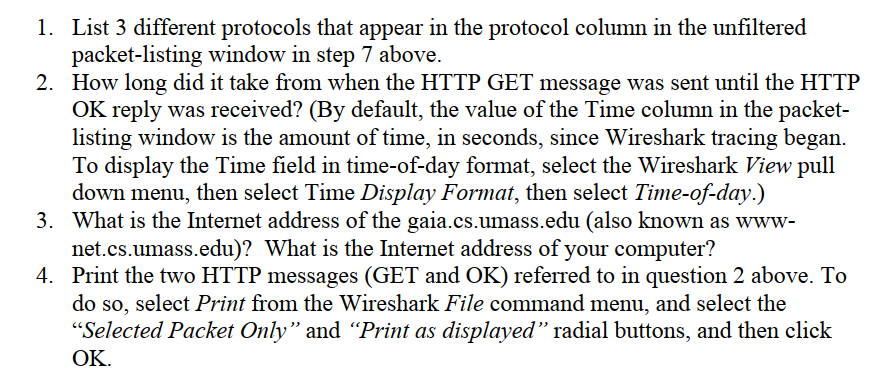

# Lab1: Getting Started

本实验主要内容是熟悉Wireshark，是一个HelloWorld性质的Lab。

### Introduction to Packet Sniff

Wireshark是一个典型的**分组嗅探器(packet sniffer)**软件，用于捕获和分析网络中传递的信息。典型的分组嗅探器由捕获单元和解析单元两部分组成。前者会将当前的网络数据流捕获并复制一份，后者依据各类协议规则对捕获分组进行解析。捕获得到的分组为链路层分组，它包含更高层网络分层的全部信息。

### Getting start

实验内容相对简单，根据提示开启Wireshark的捕获，打开Lab中提供的网页，完成后中止捕获，并筛选HTTP协议的分组，从中找到我们向该网站发送的HTTP GET请求。

### Questions

1. 在不进行HTTP限定筛选时，捕获到的分组中包含UDP、TCP、ARP等协议。
2. 调节视图选项后，可知09:43:25.829176时发送GET请求，09:43:26.117177时收到回复，用时0.288s。
3. gaia.cs.umass.edu的地址为128.119.245.12，本机地址显示为192.168.2.198。
4. 打印两条HTTP信息，略。