# Lab2: HTTP

本实验主要内容是对HTTP协议的一个简单研究，包括HTTP的GET/响应交互、HTTP报文格式、检索大HTML文件、检索具有内嵌URL的HTML文件，以及HTTP鉴别和安全性几大内容。

## 1. The Basic HTTP GET/response interaction

本实验操作部分的内容要求访问”[指定网站](http://gaia.cs.umass.edu/wireshark-labs/HTTP-wireshark-file1.html)“，并捕获其间的HTTP交互，根据捕获结果回答问题。

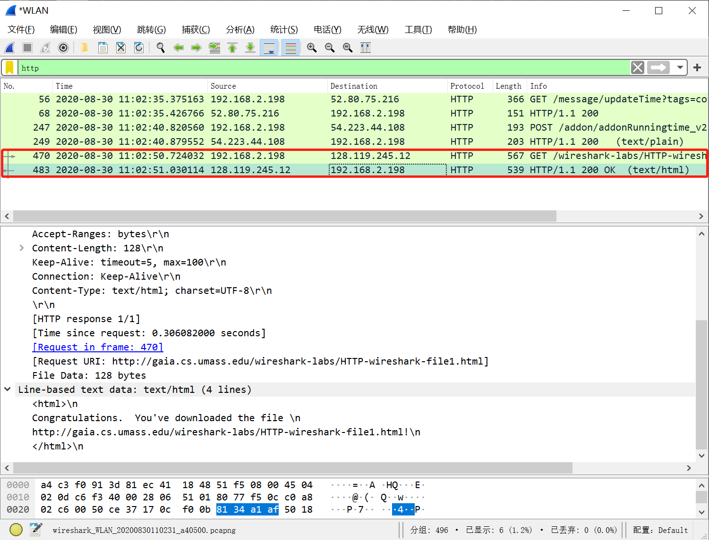

### Qustion

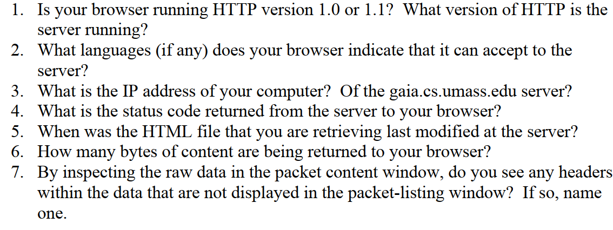

1. 根据GET请求中的Request Version字段可知，实验时本地浏览器使用HTTP v1.1；而根据服务器返回的POST响应报文，其同样使用HTTP v1.1。
2. 可接受中英文，其中中文（zh-cn）权重最高，为0.9。 
3. 本机IP：192.168.2.198；服务器IP：128.119.245.12。
4. 返回的状态码为200，表示请求成功，信息在返回的响应报文中。
5. Sat, 29 Aug 2020 05:59:01 GMT；后文给出解释，教学服务器会每隔1min刷新该文件的modified time。
6. Content部分为128字节。
7. 无。

## 2. The HTTP CONDITIONAL GET/response interaction

根据原书2.2.5节及2.2.6节，当前大部分Web浏览器会使用Proxy对对象进行缓存，与之配合使用的是<u>条件GET方法</u>。本实验要求探究这类过程，具体操作是清空浏览器当前本地缓存后，连续访问相同的”[指定网站](http://gaia.cs.umass.edu/wireshark-labs/HTTP-wireshark-file2.html)“，并捕获该过程中的信息交互。

Proxy接收到客户端的请求后，检查到缓存中存在目标文件，则Proxy向目的Web服务器发送条件GET，确认缓存器缓存时至今文件是否被修改过。若未曾被修改，Web服务器将返回一个状态码为304的空内容响应报文，告知Proxy该内容仍未过期。这一机制可以有效避免带宽浪费，减少用户感受到的响应时间。

*注：根据实验抓包结果，发送条件GET及接收304状态响应的均为本地客户端，猜测浏览器直接使用本地缓存。*

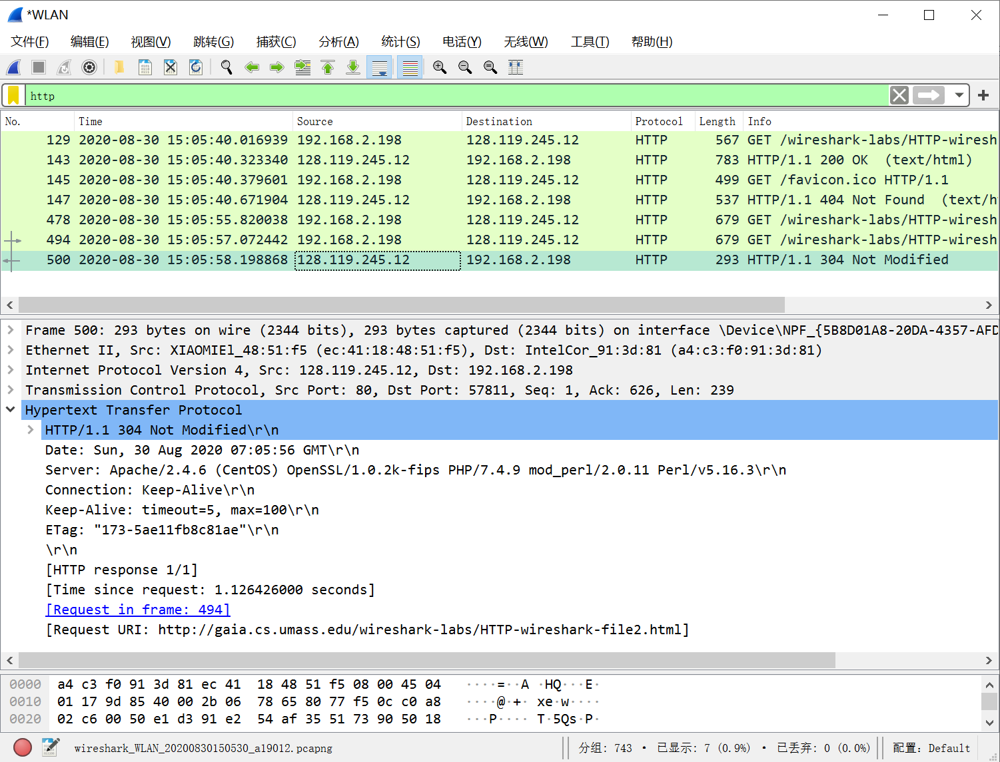

### Question

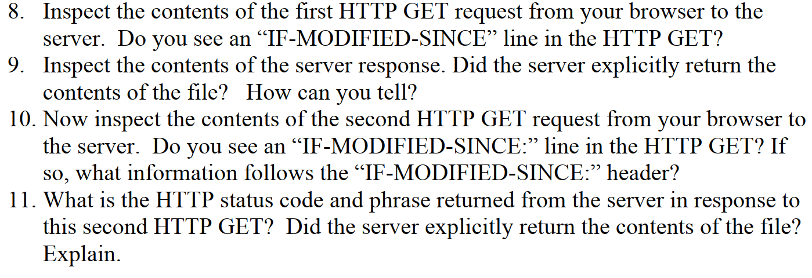

8. 第一个GET请求报文中不包含IF-MODIFIED-SINCE字段。

9. 可以判断服务器显式提供请求内容，依据是返回报文中Contents段直接包含HTML文件内容，状态码为200。
10. 第二个GET请求中包含IF-MODIFIED-SINCE字段，值为：Sun, 30 Aug 2020 05:59:01 GMT。
11. 第二个GET请求得到的响应报文状态码为304，根据原书2.2.6节，这是目的服务器对请求报文与缓存时相比未发生修改的答复，因此请求内容并非显式来自于Web服务器，而从缓存中读取。

## 3. Retrieving Long Documents  

本节讨论当请求的HTML文件较大，导致返回的HTTP报文长度过长、大于TCP报文段长度时的情况。根据实验要求，访问”[指定网站](http://gaia.cs.umass.edu/wireshark-labs/HTTP-wireshark-file3.html)“，捕获报文。

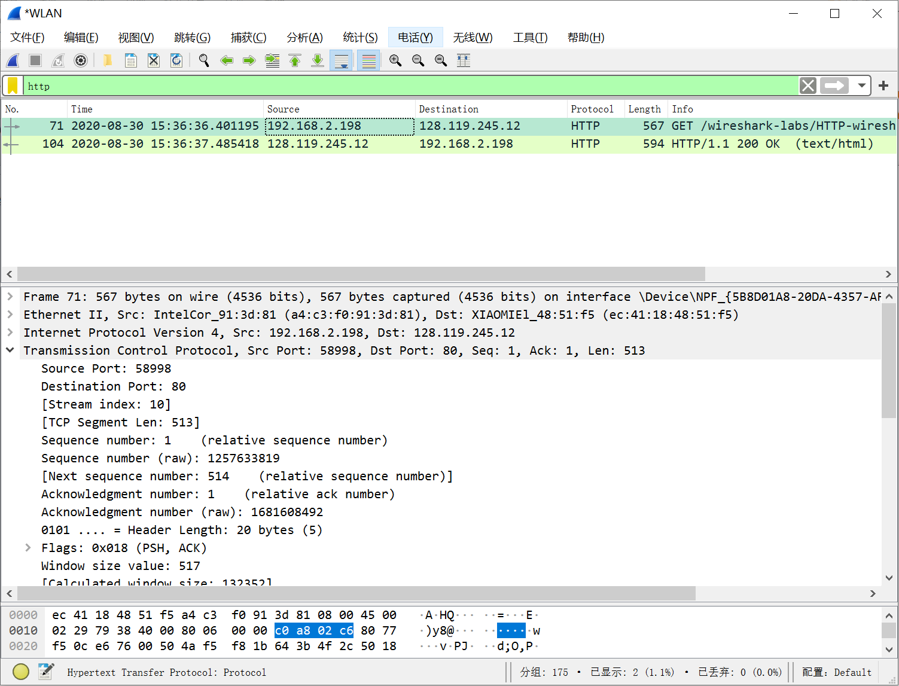

这个实验中请求的HTML文件有4,500字节的大小，大小远超TCP报文段。因此，这个HTTP响应会被分装到多个TCP报文段发送，在Wireshark中可以获得其分装信息。

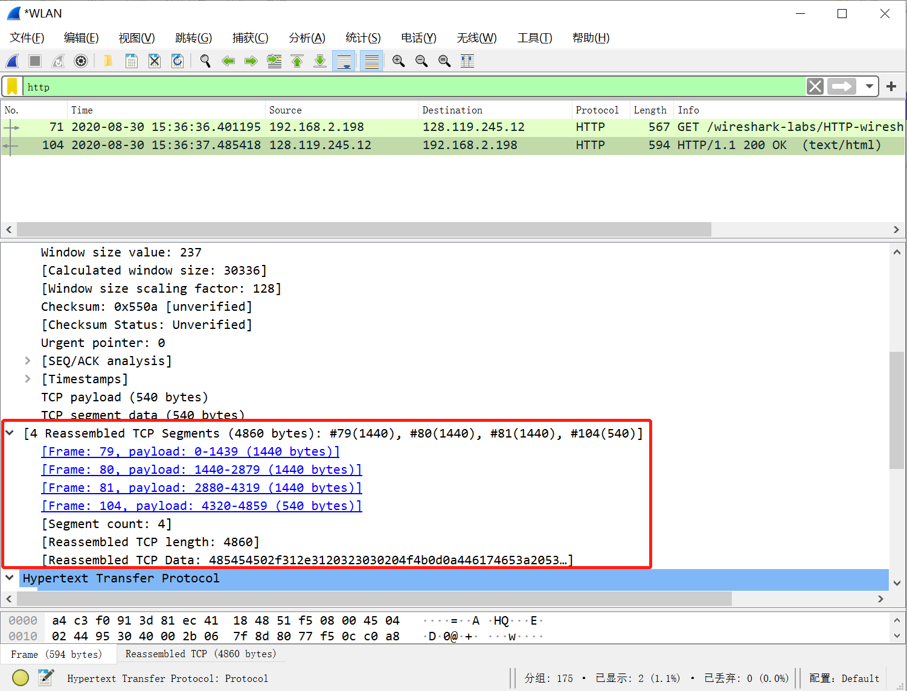

### Question

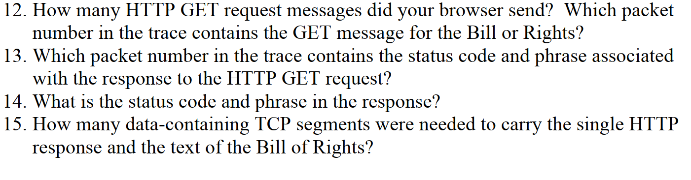

12. 本地浏览器发送了一个GET请求信息，Packet Numer是71。
13. 根据TCP报文段分装解析，装有状态码等信息的TCP段Packet Numer是79。
14. 状态码为200，Reason-Phrase为"OK"。
15. 响应报文被拆分成4个TCP报文段。

## 4. HTML Documents with Embedded Objects  

本节讨论请求嵌入了其他对象的HTML文件，典型的例子便是带有图片的文件。访问”[指定网站](http://gaia.cs.umass.edu/wireshark-labs/HTTP-wireshark-file4.html)“，捕获报文。

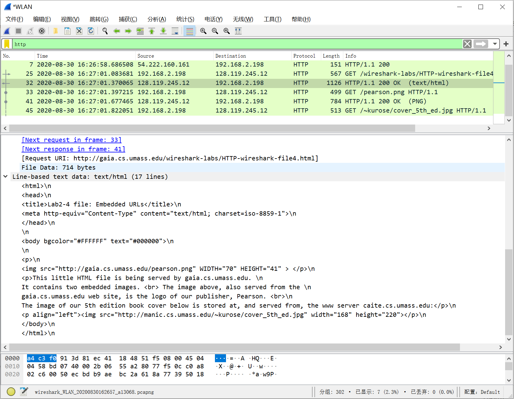

可以看见在packet-listing窗口，除了最开始对网页HTML的GET请求外，还有两个附加的对图片的GET请求。

### Question

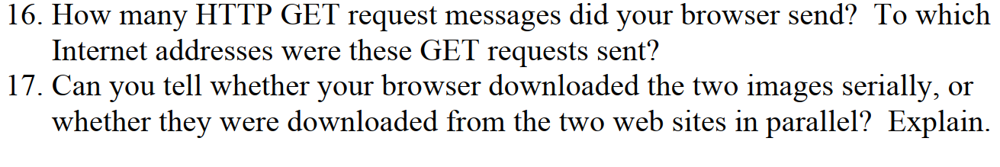

16. 本地浏览器发送了3个GET请求，目的IP均为128.119.245.12。
17. 根据packets的时间记录，GET请求是顺序发出的。

## 5. HTTP Authentication  

本节借助抓包工具来解析访问有身份验证网页时的HTTP通讯情况。实验要求访问”[指定网站](http://gaia.cs.umass.edu/wireshark-labs/protected_pages/HTTP-wiresharkfile5.html)“，捕获登录过程中的通讯情况，抓包解析。

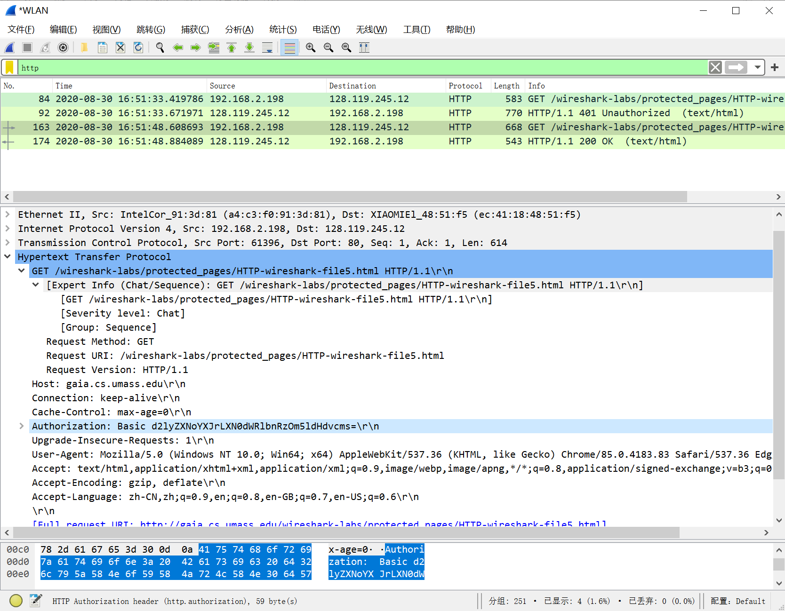

### Question

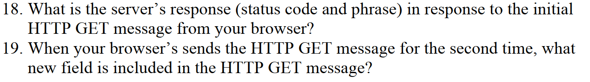

18. 第一个返回的响应状态码为401，表示用户身份未认证。
19. 第二次发送GET请求时，增加了Authorization字段。

注：值得一提的是，此处交互中对用户名和密码的编码采用了Basic64 Format，实际上是明文形式——也即，对其的捕获可以轻易解码获取用户名和密码。