# Lab3: DNS

本实验主要内容是对客户端与 *DNS(Domain Name System)* 交互的观察。客户端与DNS的通信使用**端口53**，运输层协议为**UDP**，即通讯是无连接的。


## 1. nslookup

*nslookup* 是用于向DNS服务器发送质询请求的特殊工具，且对目的DNS服务器没有明确限制，可以是根DNS服务器、TDL-DNS服务器或权威服务器，也可以是非权威服务器。其基本命令形式如下：

```shell
nslookup [-option1] [-option2] [...] host-to-find [dns-server]
```

后续实验操作中，nslookup的运行环境为 Windows10-WSL2 Ubuntu 18.04 LTS。

### Question

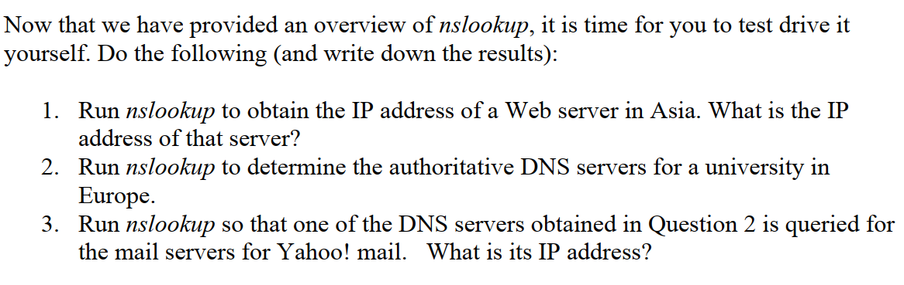

1. 简单找一个位于亚洲的网站，我们以bilibili为例：

   ```shell
   nslookup www.bilibili.com
   ```

   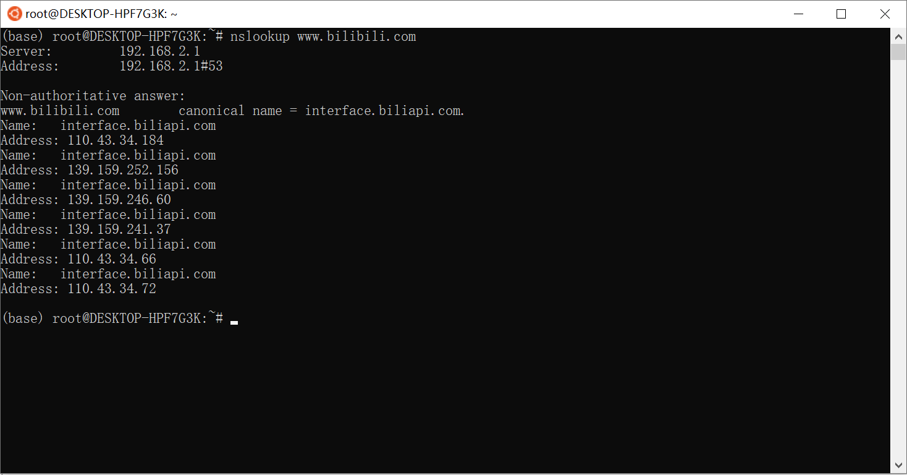

    可以看到，nslookup 返回了多个非权威DNS应答结果（也即可能来自于沿路local-DNS上的缓存）。多个IP地址，这是由于服务商架设了多台Web服务器，且理论上DNS服务器会将域名解析为距离客户端最近的Web服务器的IP；更进一步的，大部分服务器有负载均衡，会动态调整用户请求，因此客户端最终获得的IP也是动态变化的。

   我们在 *ipinfo.info* 查询第一个IPv4地址110.43.34.184，可以发现地址是中国深圳。

2.  同样地，找一个位于欧洲的大学网站，以帝国理工大学（英国）为例：

   ```shell
   nslookup -type=NS imperial.ac.uk
   ```

   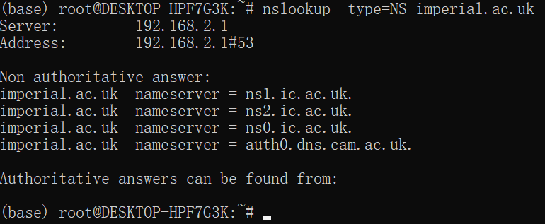

   可以看到权威DNS服务器有4个，ns1.ic.ac.uk是其中一例。

3.  第三问要求我们设置利用第二问中找到的一个权威DNS服务器去寻找Yahoo邮箱的IP，则：

   ```shell
   nslookup mail.yahoo.com ns1.ic.ac.uk.
   ```

   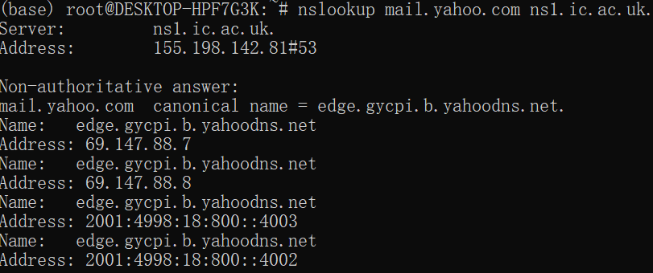

   可以得到同样有多个IP地址，其中一个为69.147.88.7。


## 2. ipconfig

*ipconfig* 同样可以用于检查DNS的信息。实验提供了两条常用的命令，分别用于查看/清除DNS缓存：

```shell
# display cached records
ipconfig /displaydns
# flush the DNS cache clears all entries and reloads the entries from the hosts file
ipconfig /flushdns
```


## 3. Tracing DNS with Wireshark

### Question: Part A

这节我们利用Wireshark来进一步分析主机与DNS交互的过程。使用ipconfig刷新DNS缓存、清理浏览器缓存后，访问 www.ietf.org ，捕获过程中的信息。

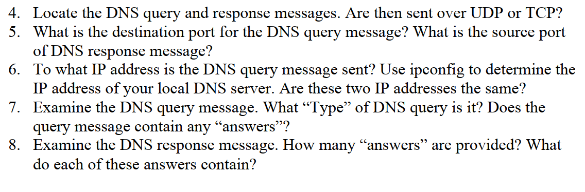

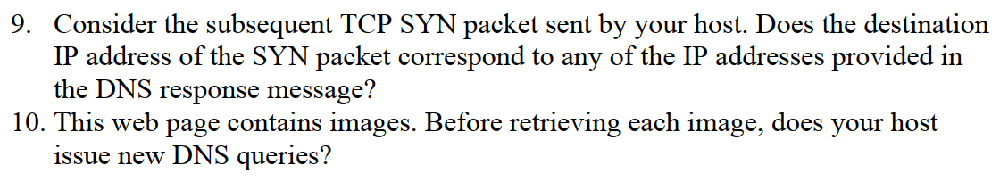

根据题设的要求，我们首先进行捕获：

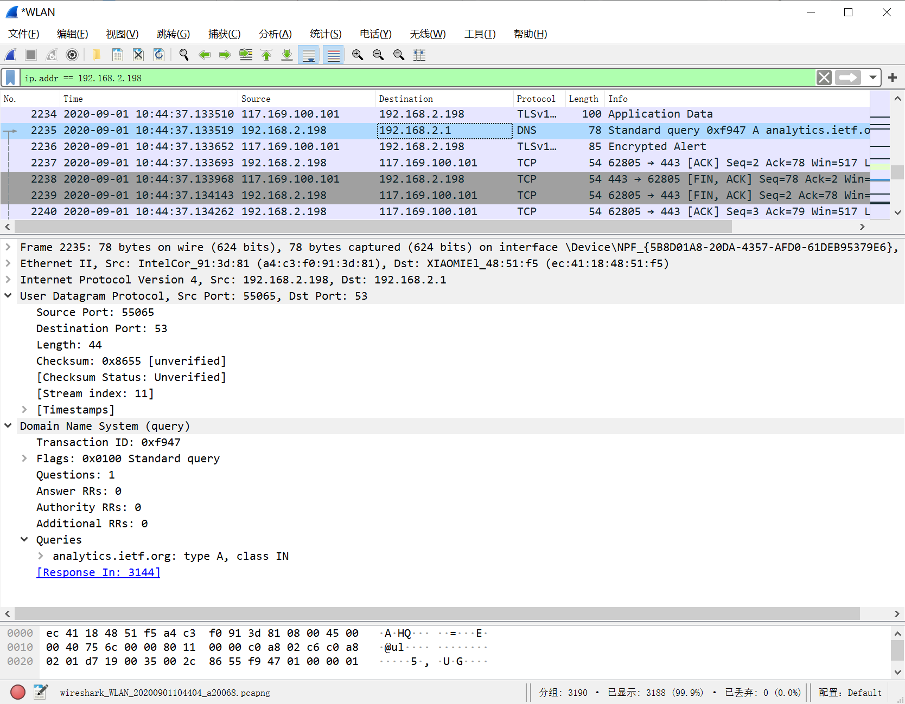

4. 根据Protocol栏信息我们找到DNS访问数据，可以看到详情页中标明 User Datagram Protocol，说明应用层使用的是UDP协议。

5. 询问信息的目的端口和回答信息的源端口都是53，而询问信息的源端口和回答信息的目的端口不是53。

6. 询问信息被发送至198.168.2.1，与ipconfig检查的本地DNS服务器IP相同。

7. type=A，没有Answer信息。

8. 答复中，Answers资源信息共有两条：一条type=CNAME，提供了访问网站的规范主机名；一条type=A，提供了访问网站的ip。

   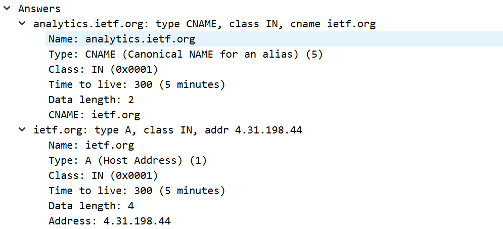

9. TCP SYN packet是用于握手的TCP分组，在视图中紧接着回复信息即被抓包，可以看到目的IP为4.31.198.44，与DNS服务器回复的地址一致。

10. 没有发起新的询问，应是使用了DNS缓存。


### Question: Part B

这节要求我们捕获使用nslookup的通讯情况：捕获 nslookup www.mit.edu 的通讯情况。

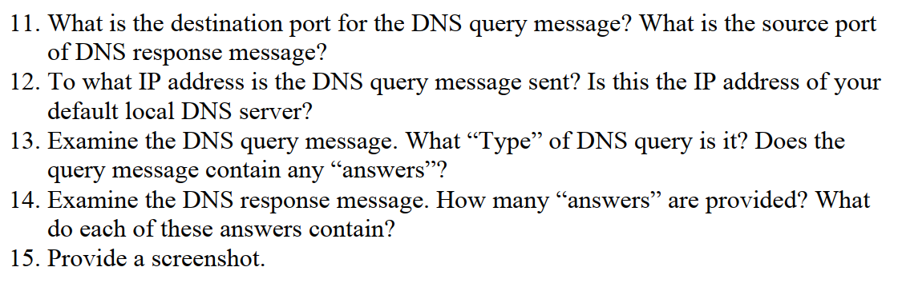

11. 询问信息目的端口与答复信息目的端口仍为53。

12. 询问信息发往192.168.2.1，与默认本地DNS服务器地址一致。

13. Type=A，询问信息中没有Answers。

14. 共有三个Answers，两个type=CNAME，一个type=A。

15. 如下图。

    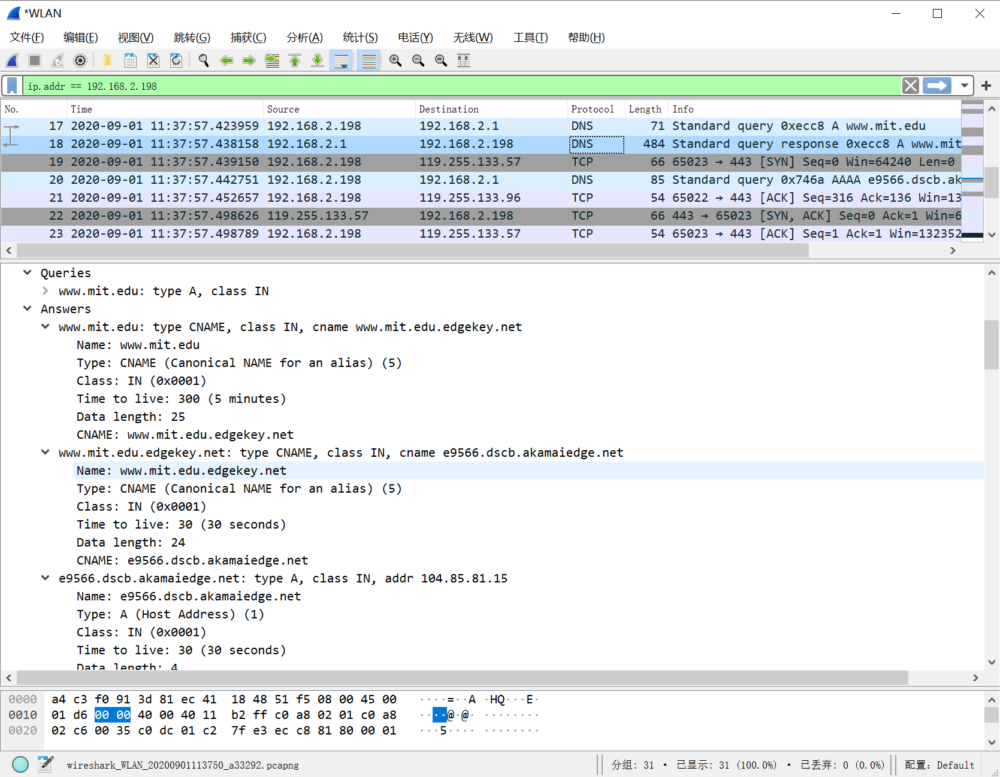


更换nslookup命令为：

```shell
nslookup -type=NS mit.edu
```

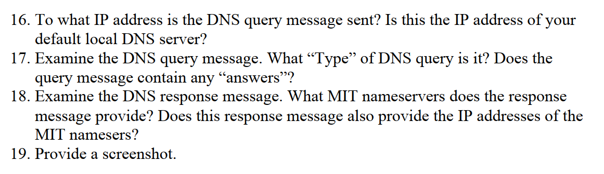

16. 询问信息仍往默认本地DNS服务器发送，IP=192.168.2.1。

17. Type=NS。不含有Answers。

18. 答复信息提供了8个MIT的权威DNS服务器，并在Additional records中提供了上述权威DNS服务器的IP地址。

19. 如下图。

    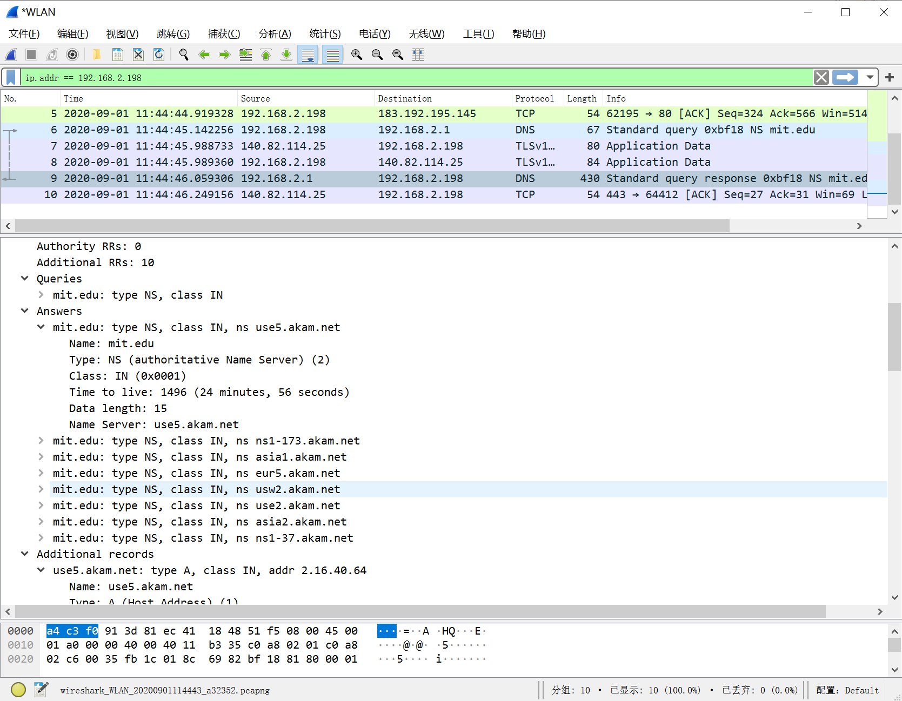


再次更换nslookup命令：

```shell
nslookup  www.aiit.or.kr bitsy.mit.edu
```

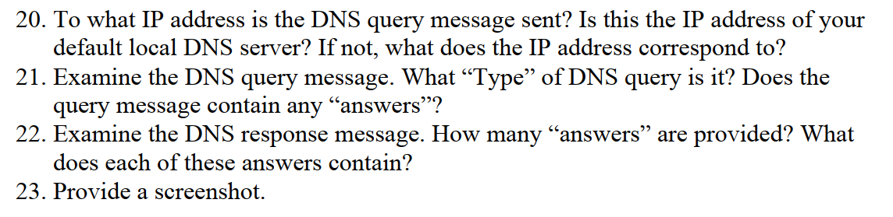

20. 在发送真正的询问之前，会有一组DNS询问/答复，主机询问默认本地DNS服务器 bitsy.mit.edu 的IP地址。之后，根据获得的IP地址进行真正的询问，此时目的DNS的IP=18.0.72.3，与默认DNS服务器不同。

21. Type=A，无Answers。

22. 提供了一个Answer，包含 www.aiit.or.kr 的IP地址。

23. 如下图。

    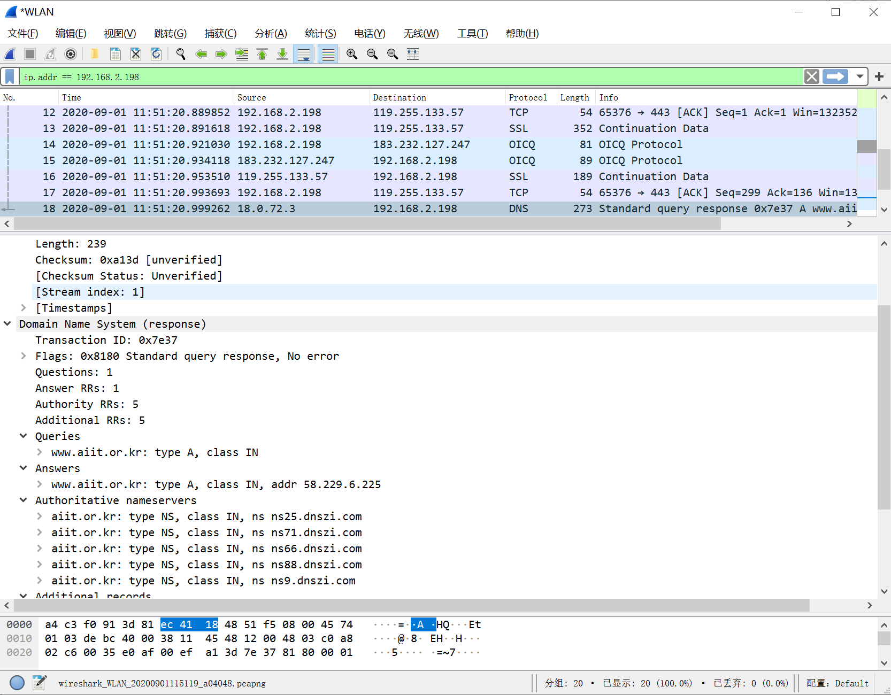

